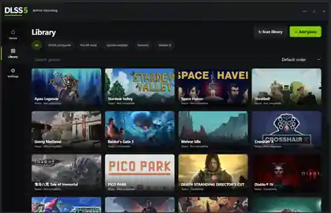
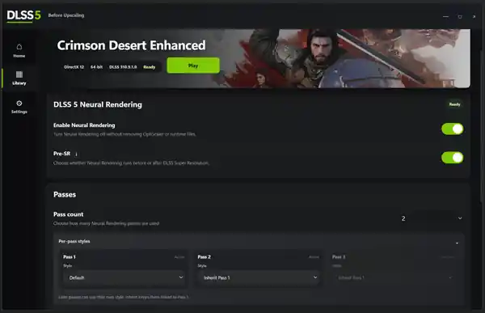

<p align="center">
  
</p>

<h1 align="center">DLSS5 Before Upscaling</h1>

<p align="center">
  Configure DLSS 5 Neural Rendering before the upscaling stage.
</p>

<p align="center">
  <code>Windows</code>&nbsp;&nbsp;
  <code>Before Upscaling</code>&nbsp;&nbsp;
  <code>1–3 passes</code>&nbsp;&nbsp;
  <code>Per-pass styles</code>&nbsp;&nbsp;
  <code>In-game overlay</code>
</p>

<p align="center">
  
</p>

---

## What it does

DLSS5 Before Upscaling gives each supported game its own Neural Rendering profile. It discovers installed titles, checks the usable rendering path, installs the managed backend, and keeps the controls for running Neural Rendering before DLSS Super Resolution in one place.

The desktop app handles setup and per-game configuration. Image-dependent tuning stays in the in-game panel, where changes can be judged against the actual frame.

## Download

DLSS5 Before Upscaling is currently in the **0.1.x preview** stage.

**[Download the latest published preview from GitHub Releases](https://github.com/NeoSixon/DLSS5-Before-Upscaling/releases).**

For the newest development build:

**[Actions](https://github.com/NeoSixon/DLSS5-Before-Upscaling/actions) → latest successful CI run → `DLSS5-Before-Upscaling-Windows-preview`**

> This is an early preview. Game compatibility may vary, and the UI and workflow may change between releases.

## Quick start

1. Download and run `DLSS5-Before-Upscaling.exe`.
2. Scan your installed game libraries or add a game manually.
3. Open a supported game's profile.
4. Enable Neural Rendering, choose Before-Upscaling / Pre-SR placement, and configure 1–3 passes.
5. Launch the game and press **Insert** to tune image-dependent options in the in-game panel.

When required, the app will ask you to select a trusted local copy of `nvngx_dlssnr.dll`.

## The render path

```text
Game frame
    │
    ▼
DLSS 5 Neural Rendering
    │
    ├── Pass 1  ── style
    ├── Pass 2  ── style / inherit
    └── Pass 3  ── style / inherit
    │
    ▼
Before Upscaling
    │
    ▼
DLSS Super Resolution
    │
    ▼
Output
```

The core workflow is simple: Neural Rendering is configured to run before the upscaling stage, with up to three managed passes.

## Inside the app

<p align="center">
  
</p>

**Game library** — Scan installed libraries, add titles manually, search, filter, favorite, hide or remove entries without deleting game files.

**Per-game profiles** — Enable DLSS 5 Neural Rendering, switch Pre-SR placement, choose 1–3 passes, and configure each pass independently.

**In-game panel** — Press **Insert** while the game is running to tune image-dependent settings against the actual frame.

**Recovery** — Managed installs keep tracked backups so original game files can be restored from the app.

## Current scope

- Windows 10/11 x64
- 64-bit games with a supported rendering path
- Native DLSS detection
- DLSS 5 Neural Rendering enable / disable
- Before-upscaling (Pre-SR) placement
- 1–3 Neural Rendering passes
- Independent style selection for each pass
- Managed OptiScaler DLSS-NR Pre-SR Multipass backend
- English and Simplified Chinese UI
- Portable Windows build

## Runtime handling

`nvngx_dlssnr.dll` is **not redistributed** by this project.

When a runtime is needed, the app asks you to select a trusted local copy, validates it locally, and can cache that copy locally for reuse. DLSS5 Before Upscaling does not present itself as an NVIDIA product and does not imply NVIDIA affiliation or endorsement.

## Build from source

Requires Node.js 22+ on Windows.

```powershell
npm ci
npm start
npm test
npm run build:portable
```

The portable executable is written to:

```text
dist-standalone/
```

## Project layout

```text
standalone/
  core/        game discovery, profiles, install state and runtime handling
  renderer/    desktop UI, library, settings and branding

scripts/
  overlay patching and icon generation

test/
  standalone regression and renderer tests
```

## Credits & licenses

DLSS5 Before Upscaling is MIT licensed.

Small retained portions of the compatibility and library-discovery code are derived from **DLSS5-Swapper by Rakan Alkhaldi** under the MIT License. The managed Neural Rendering backend is based on the independently licensed **OptiScaler DLSS-NR Pre-SR Multipass** project.

Full notices are in [THIRD_PARTY_NOTICES.md](THIRD_PARTY_NOTICES.md).

## Support

If the project is useful to you, development can be supported through [Buy Me a Coffee](https://buymeacoffee.com/NeoSixon).

---

<sub>
NVIDIA, GeForce, DLSS and related marks are trademarks of NVIDIA Corporation.
Their use here is descriptive only. DLSS5 Before Upscaling is an independent community project and is not affiliated with or endorsed by NVIDIA.
</sub>
